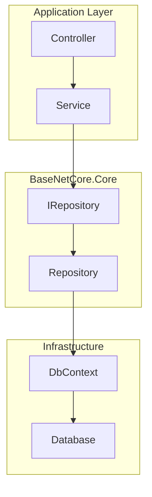

# ?? Repository Pattern

## Mục lục
- [Giới thiệu](#giới-thiệu)
- [Architecture](#architecture)
- [Interface Structure](#interface-structure)
- [Implementation](#implementation)
- [Usage Examples](#usage-examples)
- [?u ?i?m](#?u-?i?m)
- [Nh??c ?i?m](#nh??c-?i?m)
- [Best Practices](#best-practices)
- [Advanced Scenarios](#advanced-scenarios)

---

## ?? Giới thiệu

Repository Pattern là một **abstraction layer** gi?a Business Logic và Data Access, cung c?p:

- ? **Tách bi?t concerns** - Business logic không ph? thu?c vào EF Core
- ? **Testability** - D? dàng mock repositories
- ? **Consistency** - Chu?n hóa data access operations
- ? **CQRS Support** - Tách riêng Read/Write operations
- ? **Reusability** - Generic repository cho m?i entity

---

## ??? Architecture



---

## ?? Interface Structure

### IRepository<TEntity> - Full Repository

```csharp
public interface IRepository<TEntity> : IReadRepository<TEntity>, IWriteRepository<TEntity>
    where TEntity : class
{
}
```

### IReadRepository<TEntity> - Query Operations

```csharp
public interface IReadRepository<TEntity> where TEntity : class
{
    // Simple queries
    Task<TEntity> GetByIdAsync(object id);
    Task<TEntity> FindAsync(Expression<Func<TEntity, bool>> predicate, bool tracking = false);
    Task<List<TEntity>> GetAllAsync(Expression<Func<TEntity, bool>> filter = null, bool tracking = false);
    Task<int> CountAsync(Expression<Func<TEntity, bool>> filter = null);
    Task<bool> AnyAsync(Expression<Func<TEntity, bool>> filter = null);

  // Specification Pattern
    Task<List<TEntity>> GetAsync(ISpecification<TEntity> specification);
    Task<PageResponse<TEntity>> GetWithPagingAsync(ISpecification<TEntity> specification);
    Task<TEntity> FirstOrDefaultAsync(ISpecification<TEntity> specification);
    Task<int> CountAsync(ISpecification<TEntity> specification);
}
```

### IWriteRepository<TEntity> - Command Operations

```csharp
public interface IWriteRepository<TEntity> where TEntity : class
{
 void Add(TEntity entity);
    void AddRange(IEnumerable<TEntity> entities);
    void Update(TEntity entity);
    void UpdateRange(IEnumerable<TEntity> entities);
    void Delete(TEntity entity);
    void DeleteRange(IEnumerable<TEntity> entities);
    Task DeleteAsync(object id);
}
```

**?? Lưu ý:** Write operations **KHÔNG t? ??ng SaveChanges** - ?? UnitOfWork qu?n lý!

---

## ?? Implementation

### Repository<TEntity> Class

```csharp
public class Repository<TEntity> : IRepository<TEntity> where TEntity : class
{
    protected readonly DbContext _context;
    protected readonly DbSet<TEntity> _dbSet;

    public Repository(DbContext context)
    {
        _context = context ?? throw new ArgumentNullException(nameof(context));
  _dbSet = _context.Set<TEntity>();
    }

    // Read implementations...
    public virtual async Task<TEntity> GetByIdAsync(object id)
    {
    return await _dbSet.FindAsync(id);
    }

    public virtual async Task<List<TEntity>> GetAllAsync(
        Expression<Func<TEntity, bool>> filter = null, 
    bool tracking = false)
    {
  IQueryable<TEntity> query = tracking ? _dbSet : _dbSet.AsNoTracking();
        
        if (filter != null)
   {
       query = query.Where(filter);
        }
     
    return await query.ToListAsync();
    }

    // Write implementations...
    public virtual void Add(TEntity entity)
    {
        _dbSet.Add(entity);
    }

  public virtual void Update(TEntity entity)
    {
        var entry = _context.Entry(entity);
        if (entry.State == EntityState.Detached)
        {
   _dbSet.Attach(entity);
 }
        entry.State = EntityState.Modified;
    }

    public virtual void Delete(TEntity entity)
    {
  _dbSet.Remove(entity);
    }
}
```

---

## ?? Usage Examples

### Example 1: Basic CRUD Operations

```csharp
public class ProductService
{
    private readonly IUnitOfWork _unitOfWork;
    private readonly IRepository<Product> _productRepo;

    public ProductService(IUnitOfWork unitOfWork)
    {
        _unitOfWork = unitOfWork;
      _productRepo = unitOfWork.Repository<Product>();
    }

    // CREATE
    public async Task<int> CreateProduct(Product product)
    {
        _productRepo.Add(product);
        return await _unitOfWork.SaveChangesAsync();
    }

    // READ
    public async Task<Product> GetProduct(int id)
    {
return await _productRepo.GetByIdAsync(id);
}

    // UPDATE
    public async Task<int> UpdateProduct(Product product)
    {
   _productRepo.Update(product);
        return await _unitOfWork.SaveChangesAsync();
    }

    // DELETE
    public async Task<int> DeleteProduct(int id)
    {
        await _productRepo.DeleteAsync(id);
        return await _unitOfWork.SaveChangesAsync();
    }
}
```

### Example 2: Filtering with Expressions

```csharp
// L?y t?t c? sẽn ph?m active
var activeProducts = await _productRepo.GetAllAsync(
    filter: p => p.IsActive,
  tracking: false  // Read-only, không c?n tracking
);

// L?y sẽn ph?m theo giá
var expensiveProducts = await _productRepo.GetAllAsync(
    filter: p => p.Price > 1000000 && p.Stock > 0
);

// ??m sẽn ph?m theo ?i?u ki?n
var count = await _productRepo.CountAsync(p => p.Category == "Smartphone");

// Ki?m tra t?n t?i
var exists = await _productRepo.AnyAsync(p => p.Code == "IP15");
```

### Example 3: Tracking vs NoTracking

```csharp
// ? BAD - Tracking cho read-only (lãng phí memory)
var products = await _productRepo.GetAllAsync(tracking: true);
return products.Select(p => new ProductDto
{
    Id = p.Id,
    Name = p.Name
});

// ? GOOD - NoTracking cho read-only
var products = await _productRepo.GetAllAsync(tracking: false);
return products.Select(p => new ProductDto
{
    Id = p.Id,
    Name = p.Name
});

// ? GOOD - Tracking khi c?n update
var product = await _productRepo.FindAsync(p => p.Id == id, tracking: true);
product.Price = newPrice;
_productRepo.Update(product);
await _unitOfWork.SaveChangesAsync();
```

### Example 4: Bulk Operations

```csharp
// Bulk insert
var newProducts = new List<Product>
{
    new Product { Name = "Product 1", Price = 1000 },
    new Product { Name = "Product 2", Price = 2000 },
    new Product { Name = "Product 3", Price = 3000 }
};

_productRepo.AddRange(newProducts);
await _unitOfWork.SaveChangesAsync();

// Bulk update
var productsToUpdate = await _productRepo.GetAllAsync(
    filter: p => p.Category == "OldCategory",
  tracking: true  // C?n tracking ?? update
);

foreach (var product in productsToUpdate)
{
    product.Category = "NewCategory";
}

_productRepo.UpdateRange(productsToUpdate);
await _unitOfWork.SaveChangesAsync();

// Bulk delete
var productsToDelete = await _productRepo.GetAllAsync(
    filter: p => p.IsDeleted
);

_productRepo.DeleteRange(productsToDelete);
await _unitOfWork.SaveChangesAsync();
```

### Example 5: Using with Specification Pattern

```csharp
// Tạo specification
var spec = new BaseSpecification<Product>()
    .WithCriteria(p => p.IsActive)
    .WithOrderBy(p => p.Name)
    .WithPagedResults(pageNumber: 1, pageSize: 20);

// Get với pagination
var pagedResult = await _productRepo.GetWithPagingAsync(spec);

Console.WriteLine($"Total: {pagedResult.Total}");
Console.WriteLine($"Page {pagedResult.CurrentPage} of {Math.Ceiling(pagedResult.Total / (double)pagedResult.PageSize)}");
foreach (var product in pagedResult.Data)
{
    Console.WriteLine($"- {product.Name}: {product.Price:C}");
}
```

---

## ? ?u ?i?m

### 1. Tách bi?t Concerns

```csharp
// ? BAD - Business logic bi?t v? EF Core
public class ProductService
{
    private readonly ApplicationDbContext _context;

    public async Task<Product> GetProduct(int id)
    {
      return await _context.Products
            .AsNoTracking()
            .FirstOrDefaultAsync(p => p.Id == id);
    }
}

// ? GOOD - Business logic ch? bi?t v? Repository
public class ProductService
{
    private readonly IRepository<Product> _productRepo;

    public async Task<Product> GetProduct(int id)
    {
        return await _productRepo.GetByIdAsync(id);
    }
}
```

### 2. Testability

```csharp
// Unit test với mock repository
[Test]
public async Task CreateProduct_ShouldReturnProductId()
{
    // Arrange
    var mockRepo = new Mock<IRepository<Product>>();
    var mockUnitOfWork = new Mock<IUnitOfWork>();
    mockUnitOfWork.Setup(u => u.Repository<Product>()).Returns(mockRepo.Object);
    mockUnitOfWork.Setup(u => u.SaveChangesAsync(default)).ReturnsAsync(1);

 var service = new ProductService(mockUnitOfWork.Object);
    var product = new Product { Name = "Test" };

    // Act
    var result = await service.CreateProduct(product);

    // Assert
    Assert.AreEqual(1, result);
    mockRepo.Verify(r => r.Add(It.IsAny<Product>()), Times.Once);
}
```

### 3. Consistency

T?t c? services dùng cùng cách truy v?n data:

```csharp
// ProductService
var product = await _productRepo.GetByIdAsync(id);

// CustomerService
var customer = await _customerRepo.GetByIdAsync(id);

// OrderService
var order = await _orderRepo.GetByIdAsync(id);
```

### 4. Reusability

M?t repository cho t?t c? entities:

```csharp
public class GenericService<TEntity> where TEntity : class
{
    protected readonly IRepository<TEntity> _repository;
 protected readonly IUnitOfWork _unitOfWork;

    public GenericService(IUnitOfWork unitOfWork)
{
   _unitOfWork = unitOfWork;
        _repository = unitOfWork.Repository<TEntity>();
    }

    public virtual async Task<TEntity> GetByIdAsync(object id)
    {
        return await _repository.GetByIdAsync(id);
    }
}
```

---

## ?? Nh??c ?i?m

### 1. Abstraction Overhead

- Thêm một layer gi?a business logic và database
- Có th? làm ph?c t?p cho simple queries

### 2. Learning Curve

- Developers m?i c?n h?c Repository + Specification patterns
- Ph?c t?p h?n so với direct DbContext access

### 3. Performance (n?u dùng sai)

```csharp
// ? BAD - Multiple database calls
var product = await _productRepo.GetByIdAsync(id);
var category = await _categoryRepo.GetByIdAsync(product.CategoryId);
var reviews = await _reviewRepo.GetAllAsync(r => r.ProductId == id);

// ? GOOD - Single query with includes
var spec = new BaseSpecification<Product>()
    .WithCriteria(p => p.Id == id)
    .WithInclude(p => p.Category)
    .WithInclude(p => p.Reviews);

var product = await _productRepo.FirstOrDefaultAsync(spec);
```

---

## ?? Best Practices

### 1. AsNoTracking cho Read-Only

```csharp
// ? Always use AsNoTracking for read-only queries
var products = await _productRepo.GetAllAsync(tracking: false);
```

### 2. Dùng Specification cho Complex Queries

```csharp
// ? BAD - Complex logic trong service
var products = await _productRepo.GetAllAsync(
    filter: p => p.IsActive && p.Price > 1000 && p.Stock > 0
);

// ? GOOD - Encapsulate trong Specification
var spec = new ActiveProductsWithStockSpec(minPrice: 1000);
var products = await _productRepo.GetAsync(spec);
```

### 3. Bulk Operations

```csharp
// ? Use AddRange/UpdateRange/DeleteRange cho bulk
_productRepo.AddRange(newProducts);
await _unitOfWork.SaveChangesAsync();  // Ch? 1 SaveChanges
```

### 4. Explicit Transaction

```csharp
using var transaction = await _unitOfWork.BeginTransactionAsync();
try
{
    _productRepo.Add(product);
    await _unitOfWork.SaveChangesAsync();

    _orderRepo.Add(order);
    await _unitOfWork.SaveChangesAsync();

    await _unitOfWork.CommitTransactionAsync();
}
catch
{
    await _unitOfWork.RollbackTransactionAsync();
    throw;
}
```

---

## ?? Advanced Scenarios

### Custom Repository với Domain-Specific Methods

```csharp
public interface IProductRepository : IRepository<Product>
{
    Task<List<Product>> GetLowStockProductsAsync(int threshold);
    Task<Dictionary<string, int>> GetProductCountByCategoryAsync();
}

public class ProductRepository : Repository<Product>, IProductRepository
{
    public ProductRepository(DbContext context) : base(context) { }

    public async Task<List<Product>> GetLowStockProductsAsync(int threshold)
    {
  return await _dbSet
        .AsNoTracking()
        .Where(p => p.Stock <= threshold && p.IsActive)
            .OrderBy(p => p.Stock)
 .ToListAsync();
    }

    public async Task<Dictionary<string, int>> GetProductCountByCategoryAsync()
    {
    return await _dbSet
       .AsNoTracking()
    .GroupBy(p => p.Category)
        .Select(g => new { Category = g.Key, Count = g.Count() })
 .ToDictionaryAsync(x => x.Category, x => x.Count);
    }
}
```

### Read-Only Repository

```csharp
public class ReadOnlyProductService
{
    private readonly IReadRepository<Product> _productRepo;

    public ReadOnlyProductService(IUnitOfWork unitOfWork)
    {
        _productRepo = unitOfWork.Repository<Product>();
    }

    // Ch? có read methods - không th? modify data
public async Task<List<Product>> GetProducts()
  {
        return await _productRepo.GetAllAsync(tracking: false);
    }
}
```

---

## ?? Related Topics

- [Unit of Work Pattern](Unit-Of-Work.md)
- [Specification Pattern](Specification-Pattern.md)
- [Query Object Pattern](Query-Object-Pattern.md)
- [Performance Optimization](../12-Best-Practices/Performance-Optimization.md)

---

**[? Back to Documentation](../README.md)**
