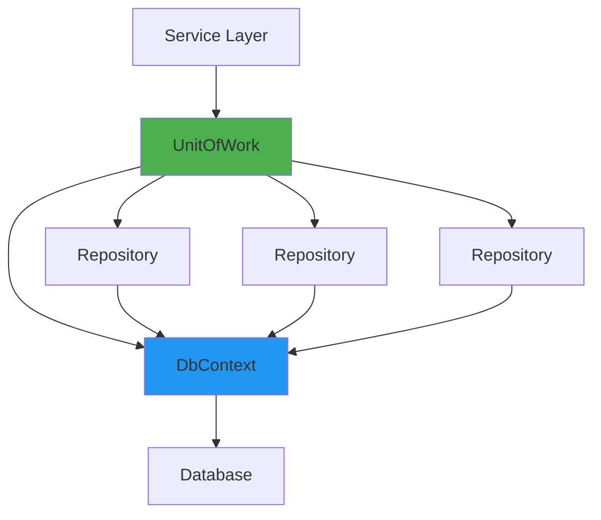

# ?? Unit of Work Pattern

## Mục lục
- [Giới thiệu](#giới-thiệu)
- [Architecture](#architecture)
- [Implementation](#implementation)
- [Usage Examples](#usage-examples)
- [Transaction Management](#transaction-management)
- [?u ?i?m](#?u-?i?m)
- [Nh??c ?i?m](#nh??c-?i?m)
- [Best Practices](#best-practices)

---

## ?? Giới thiệu

**Unit of Work Pattern** qu?n lý:

- ? **Transactions** - ??m b?o ACID properties
- ? **SaveChanges** - T?p trung lưu changes
- ? **Repository Management** - Lazy loading + caching repositories
- ? **Resource Cleanup** - Dispose pattern

### Gi?i quy?t v?n ?? gì?

```csharp
// ? PROBLEM - M?i repository t? SaveChanges
productRepo.Add(product);
await productRepo.SaveChangesAsync();  // DB call #1

orderRepo.Add(order);
await orderRepo.SaveChangesAsync();    // DB call #2

// ?? N?u orderRepo fails ? product ?ã lưu ? Inconsistent state!
```

```csharp
// ? SOLUTION - UnitOfWork qu?n lý t?t c? changes
productRepo.Add(product);
orderRepo.Add(order);
await unitOfWork.SaveChangesAsync();   // Single DB call, atomic
```

---

## ??? Architecture



---

## ?? Interface

```csharp
public interface IUnitOfWork : IDisposable
{
    /// <summary>
    /// Get repository cho b?t k? entity type nào
 /// </summary>
    IRepository<TEntity> Repository<TEntity>() where TEntity : class;

    /// <summary>
    /// Lưu t?t c? changes vào database
  /// </summary>
    Task<int> SaveChangesAsync(CancellationToken cancellationToken = default);

    /// <summary>
    /// B?t ??u transaction
    /// </summary>
    Task<IDbContextTransaction> BeginTransactionAsync(CancellationToken cancellationToken = default);

    /// <summary>
    /// Commit transaction và save changes
    /// </summary>
    Task CommitTransactionAsync(CancellationToken cancellationToken = default);

  /// <summary>
    /// Rollback transaction
    /// </summary>
    Task RollbackTransactionAsync(CancellationToken cancellationToken = default);
}
```

---

## ?? Implementation

```csharp
public class UnitOfWork : IUnitOfWork
{
    private readonly DbContext _context;
    private IDbContextTransaction _transaction;
    private readonly Dictionary<Type, object> _repositories;

    public UnitOfWork(DbContext context)
    {
   _context = context ?? throw new ArgumentNullException(nameof(context));
    _repositories = new Dictionary<Type, object>();
    }

    /// <summary>
    /// Lazy load repository với caching
    /// </summary>
    public IRepository<TEntity> Repository<TEntity>() where TEntity : class
    {
        var type = typeof(TEntity);

        if (!_repositories.TryGetValue(type, out var repository))
    {
      repository = new Repository<TEntity>(_context);
            _repositories[type] = repository;
        }

        return (IRepository<TEntity>)repository;
    }

    public async Task<int> SaveChangesAsync(CancellationToken cancellationToken = default)
  {
        return await _context.SaveChangesAsync(cancellationToken);
    }

    public async Task<IDbContextTransaction> BeginTransactionAsync(CancellationToken cancellationToken = default)
    {
        _transaction = await _context.Database.BeginTransactionAsync(cancellationToken);
        return _transaction;
    }

 public async Task CommitTransactionAsync(CancellationToken cancellationToken = default)
    {
  try
        {
         await SaveChangesAsync(cancellationToken);
   
         if (_transaction != null)
            {
          await _transaction.CommitAsync(cancellationToken);
   }
        }
        catch
  {
       await RollbackTransactionAsync(cancellationToken);
          throw;
        }
        finally
{
            if (_transaction != null)
            {
    await _transaction.DisposeAsync();
           _transaction = null;
            }
   }
 }

 public async Task RollbackTransactionAsync(CancellationToken cancellationToken = default)
  {
        if (_transaction != null)
  {
   await _transaction.RollbackAsync(cancellationToken);
        await _transaction.DisposeAsync();
            _transaction = null;
      }
    }

    public void Dispose()
    {
        _transaction?.Dispose();
        _repositories.Clear();
        _context.Dispose();
    }
}
```

---

## ?? Usage Examples

### Example 1: Basic Usage

```csharp
public class ProductService
{
    private readonly IUnitOfWork _unitOfWork;

    public ProductService(IUnitOfWork unitOfWork)
    {
        _unitOfWork = unitOfWork;
    }

    public async Task<int> CreateProduct(Product product)
    {
        var productRepo = _unitOfWork.Repository<Product>();
        
      productRepo.Add(product);
        
        return await _unitOfWork.SaveChangesAsync();
    }
}
```

### Example 2: Multiple Repositories

```csharp
public async Task<int> CreateOrderWithItems(Order order, List<OrderItem> items)
{
  var orderRepo = _unitOfWork.Repository<Order>();
    var itemRepo = _unitOfWork.Repository<OrderItem>();
    var productRepo = _unitOfWork.Repository<Product>();

    // Add order
    orderRepo.Add(order);

  // Add items
    itemRepo.AddRange(items);

    // Update product stock
    foreach (var item in items)
 {
        var product = await productRepo.GetByIdAsync(item.ProductId);
        product.Stock -= item.Quantity;
     productRepo.Update(product);
    }

    // Single SaveChanges cho t?t c? operations
    return await _unitOfWork.SaveChangesAsync();
}
```

### Example 3: Transaction Management

```csharp
public async Task TransferStock(int fromWarehouseId, int toWarehouseId, int productId, int quantity)
{
    using var transaction = await _unitOfWork.BeginTransactionAsync();
    
    try
    {
        var warehouseRepo = _unitOfWork.Repository<Warehouse>();

        // Deduct from source
 var fromWarehouse = await warehouseRepo.GetByIdAsync(fromWarehouseId);
        if (fromWarehouse.Stock < quantity)
        {
          throw new BusinessException("Insufficient stock");
        }
  fromWarehouse.Stock -= quantity;
   warehouseRepo.Update(fromWarehouse);
        await _unitOfWork.SaveChangesAsync();

        // Add to destination
        var toWarehouse = await warehouseRepo.GetByIdAsync(toWarehouseId);
        toWarehouse.Stock += quantity;
        warehouseRepo.Update(toWarehouse);
        await _unitOfWork.SaveChangesAsync();

    // Commit n?u t?t c? thành công
        await _unitOfWork.CommitTransactionAsync();
    }
    catch
    {
    await _unitOfWork.RollbackTransactionAsync();
    throw;
    }
}
```

### Example 4: Batch Processing

```csharp
public async Task<int> ImportProducts(List<Product> products)
{
    var productRepo = _unitOfWork.Repository<Product>();
    var categoryRepo = _unitOfWork.Repository<Category>();

    using var transaction = await _unitOfWork.BeginTransactionAsync();
    
    try
    {
 // Process in batches of 100
        const int batchSize = 100;
        for (int i = 0; i < products.Count; i += batchSize)
        {
          var batch = products.Skip(i).Take(batchSize).ToList();
          
          // Validate categories exist
          var categoryIds = batch.Select(p => p.CategoryId).Distinct();
          foreach (var categoryId in categoryIds)
      {
       var exists = await categoryRepo.AnyAsync(c => c.Id == categoryId);
         if (!exists)
          {
     throw new BusinessException($"Category {categoryId} not found");
                }
   }

      // Add batch
            productRepo.AddRange(batch);
    await _unitOfWork.SaveChangesAsync();
     }

      await _unitOfWork.CommitTransactionAsync();
return products.Count;
    }
  catch
    {
        await _unitOfWork.RollbackTransactionAsync();
        throw;
    }
}
```

---

## ?? Transaction Management

### Transaction Isolation Levels

```csharp
public async Task ProcessWithIsolationLevel()
{
    var transaction = await _unitOfWork.BeginTransactionAsync();
    
    // Set isolation level
    await _context.Database.ExecuteSqlRawAsync(
        "SET TRANSACTION ISOLATION LEVEL READ COMMITTED");

    try
    {
      // Your operations...
        await _unitOfWork.CommitTransactionAsync();
    }
    catch
    {
        await _unitOfWork.RollbackTransactionAsync();
   throw;
    }
}
```

### Nested Transactions

```csharp
// ?? EF Core không h? tr? nested transactions!
// Dùng SavePoints thay th?:

public async Task ProcessWithSavepoint()
{
    using var transaction = await _unitOfWork.BeginTransactionAsync();
    
    try
    {
        // Operation 1
        _productRepo.Add(product1);
        await _unitOfWork.SaveChangesAsync();
        await transaction.CreateSavepointAsync("AfterProduct1");

        // Operation 2
        _productRepo.Add(product2);
      await _unitOfWork.SaveChangesAsync();

    await _unitOfWork.CommitTransactionAsync();
    }
    catch
    {
    // Rollback to savepoint instead of full rollback
        await transaction.RollbackToSavepointAsync("AfterProduct1");
  await _unitOfWork.SaveChangesAsync();
    }
}
```

---

## ? ?u ?i?m

### 1. Atomic Operations

```csharp
// ? All-or-nothing - Không có partial success
orderRepo.Add(order);
itemRepo.AddRange(items);
productRepo.UpdateRange(products);

await _unitOfWork.SaveChangesAsync();  // Atomic
```

### 2. Single Point of Save

```csharp
// ? T?t c? changes ???c track và save cùng lúc
_unitOfWork.Repository<Product>().Add(product);
_unitOfWork.Repository<Category>().Update(category);
_unitOfWork.Repository<Order>().Delete(order);

await _unitOfWork.SaveChangesAsync();  // 1 DB call
```

### 3. Repository Caching

```csharp
// ? Cùng repository instance ???c reuse
var repo1 = _unitOfWork.Repository<Product>();
var repo2 = _unitOfWork.Repository<Product>();

// repo1 == repo2 (same instance)
```

### 4. Testability

```csharp
// Mock UnitOfWork trong unit tests
var mockUnitOfWork = new Mock<IUnitOfWork>();
var mockProductRepo = new Mock<IRepository<Product>>();

mockUnitOfWork
    .Setup(u => u.Repository<Product>())
    .Returns(mockProductRepo.Object);

mockUnitOfWork
    .Setup(u => u.SaveChangesAsync(default))
    .ReturnsAsync(1);
```

---

## ?? Nh??c ?i?m

### 1. Abstraction Overhead

- Thêm một layer gi?a services và DbContext
- Có th? overkill cho simple applications

### 2. Memory Usage

```csharp
// ?? C?n th?n với long-lived DbContext
public class LongRunningService
{
    private readonly IUnitOfWork _unitOfWork;  // ? Scoped lifetime

    // DbContext track t?t c? entities ? Memory leak!
}
```

**Gi?i pháp:** Dùng scoped services ho?c dispose UnitOfWork th??ng xuyên.

### 3. Learning Curve

Developers c?n hi?u:
- Repository Pattern
- Unit of Work Pattern
- Transaction management
- EF Core change tracking

---

## ?? Best Practices

### 1. Register as Scoped

```csharp
// Program.cs
builder.Services.AddScoped<IUnitOfWork>(provider =>
{
    var dbContext = provider.GetRequiredService<ApplicationDbContext>();
    return new UnitOfWork(dbContext);
});
```

### 2. Explicit Transaction cho Critical Operations

```csharp
// ? GOOD - Explicit transaction
using var transaction = await _unitOfWork.BeginTransactionAsync();
try
{
    // Critical operations...
    await _unitOfWork.CommitTransactionAsync();
}
catch
{
    await _unitOfWork.RollbackTransactionAsync();
    throw;
}
```

### 3. SaveChanges After Each Logical Unit

```csharp
// ? GOOD - Multiple SaveChanges trong transaction
using var transaction = await _unitOfWork.BeginTransactionAsync();

// Unit 1: Create order
orderRepo.Add(order);
await _unitOfWork.SaveChangesAsync();  // Get order.Id

// Unit 2: Create items (needs order.Id)
foreach (var item in items)
{
    item.OrderId = order.Id;
    itemRepo.Add(item);
}
await _unitOfWork.SaveChangesAsync();

await _unitOfWork.CommitTransactionAsync();
```

### 4. Dispose Pattern

```csharp
// ? GOOD - Using statement
public async Task ProcessOrder()
{
    using var unitOfWork = new UnitOfWork(_context);
    
    // Operations...
    
    await unitOfWork.SaveChangesAsync();
}  // Auto dispose
```

### 5. Handle Concurrency

```csharp
try
{
    await _unitOfWork.SaveChangesAsync();
}
catch (DbUpdateConcurrencyException ex)
{
  // Handle concurrency conflict
    foreach (var entry in ex.Entries)
    {
  var databaseValues = await entry.GetDatabaseValuesAsync();
        
    if (databaseValues == null)
        {
            // Entity was deleted
 throw new NotFoundException("Entity was deleted by another user");
        }
        
        // Resolve conflict...
    }
}
```

---

## ?? Advanced Scenarios

### Custom UnitOfWork với Domain Events

```csharp
public class UnitOfWorkWithEvents : UnitOfWork
{
    private readonly IEventPublisher _eventPublisher;

    public UnitOfWorkWithEvents(DbContext context, IEventPublisher eventPublisher)
        : base(context)
    {
        _eventPublisher = eventPublisher;
    }

    public override async Task<int> SaveChangesAsync(CancellationToken cancellationToken = default)
    {
        // Collect domain events
        var domainEvents = _context.ChangeTracker
         .Entries<IAggregateRoot>()
     .SelectMany(e => e.Entity.DomainEvents)
.ToList();

        // Save changes
   var result = await base.SaveChangesAsync(cancellationToken);

        // Publish events after successful save
     foreach (var domainEvent in domainEvents)
        {
      await _eventPublisher.PublishAsync(domainEvent);
        }

        return result;
    }
}
```

---

## ?? Related Topics

- [Repository Pattern](Repository-Pattern.md)
- [Transaction Management](../12-Best-Practices/Performance-Optimization.md#transaction-management)
- [Testing Strategies](../12-Best-Practices/Testing-Strategies.md)

---

**[? Back to Documentation](../README.md)**
