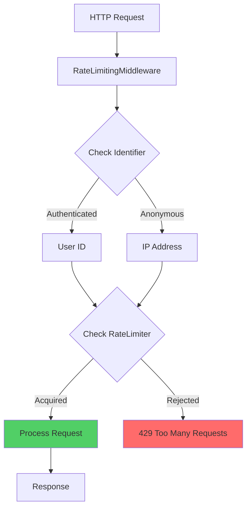

# ? Rate Limiting

## M?c l?c
- [Gi?i thi?u](#gi?i-thi?u)
- [Architecture](#architecture)
- [Configuration](#configuration)
- [Rate Limiter Types](#rate-limiter-types)
- [Usage Examples](#usage-examples)
- [Whitelisting Paths](#whitelisting-paths)
- [Response Headers](#response-headers)
- [Best Practices](#best-practices)
- [Testing](#testing)

---

## ?? Gi?i thi?u

**Rate Limiting** b?o v? API kh?i:

- ??? **DDoS attacks** - Ch?n traffic ??c h?i
- ?? **Resource exhaustion** - B?o v? database/server
- ?? **Fair usage** - ??m b?o công b?ng cho users
- ?? **Cost control** - Ki?m soát third-party API costs

### ?? Features

- ? **4 Rate Limiter Types**: Fixed Window, Sliding Window, Token Bucket, Concurrency
- ? **Flexible Configuration**: Per-endpoint ho?c global
- ? **Path Whitelisting**: B? qua health checks, metrics
- ? **Queue Support**: Queue requests khi ??t limit
- ? **Custom Headers**: `X-RateLimit-*` headers
- ? **User/IP-based**: T? ??ng identify theo JWT ho?c IP

---

## ??? Architecture



---

## ?? Configuration

### appsettings.json

```json
{
  "RateLimiting": {
    "Enabled": true,
    "PermitLimit": 100,
    "WindowSeconds": 60,
"RetryAfterSeconds": 5,
    "PolicyName": "GlobalPolicy",
    "RateLimitExceededMessage": "Quá nhi?u requests. Vui lòng th? l?i sau.",
    "IncludeRateLimitHeaders": true,
    "QueueLimit": 10,
    "Type": "Sliding",
    "WhitelistedPaths": [
      "/health",
      "/metrics",
      "/api/status",
      "/swagger"
    ]
  }
}
```

### Configuration Options

| Property | Type | Default | Description |
|----------|------|---------|-------------|
| `Enabled` | bool | `true` | B?t/t?t rate limiting |
| `PermitLimit` | int | `100` | S? requests t?i ?a trong window |
| `WindowSeconds` | int | `60` | Th?i gian window (giây) |
| `RetryAfterSeconds` | int | `60` | Th?i gian ch? tr??c khi retry |
| `PolicyName` | string | `null` | Tên policy ?? tracking |
| `RateLimitExceededMessage` | string | `null` | Custom message khi limit |
| `IncludeRateLimitHeaders` | bool | `true` | Thêm `X-RateLimit-*` headers |
| `QueueLimit` | int | `0` | S? requests ???c queue |
| `Type` | enum | `Fixed` | Lo?i rate limiter |
| `WhitelistedPaths` | string[] | `[]` | Paths ???c b? qua |

---

## ?? Rate Limiter Types

### 1. Fixed Window

**??c ?i?m:**
- ? ??n gi?n, d? hi?u
- ? Low memory usage
- ?? Có th? b? "burst" ? ??u window

```json
{
  "Type": "Fixed",
  "PermitLimit": 100,
  "WindowSeconds": 60
}
```

**Ví d?:** 100 requests/60s
- 00:00-00:59: 100 requests OK
- 01:00-01:59: 100 requests m?i

### 2. Sliding Window (Recommended)

**??c ?i?m:**
- ? Smooth rate limiting
- ? Không có "burst" problem
- ?? Slightly higher memory

```json
{
  "Type": "Sliding",
  "PermitLimit": 100,
  "WindowSeconds": 60
}
```

**Ví d?:** 100 requests/60s sliding
- Window di chuy?n liên t?c
- M?i segment tracking riêng

### 3. Token Bucket

**??c ?i?m:**
- ? Allow burst traffic
- ? Flexible replenishment
- ?? Complex configuration

```json
{
  "Type": "TokenBucket",
  "PermitLimit": 100,
  "WindowSeconds": 60
}
```

**Ví d?:** 
- Bucket capacity: 100 tokens
- Refill: 50 tokens/30s

### 4. Concurrency

**??c ?i?m:**
- ? Limit concurrent requests
- ? Good for long-running operations
- ?? Không track time window

```json
{
  "Type": "Concurrency",
  "PermitLimit": 10
}
```

**Ví d?:** Max 10 concurrent requests

---

## ?? Usage Examples

### Example 1: Basic Setup

```csharp
// Program.cs
using BaseNetCore.Core.src.Main.Extensions;
using BaseNetCore.Core.src.Main.Security.RateLimited;

var builder = WebApplication.CreateBuilder(args);

// Add Rate Limiting
builder.Services.AddBaseRateLimiting(builder.Configuration);

var app = builder.Build();

// Use Rate Limiting Middleware EARLY in pipeline
app.UseMiddleware<RateLimitingMiddleware>();

// Other middleware...
app.UseAuthentication();
app.UseAuthorization();

app.MapControllers();
app.Run();
```

### Example 2: Development vs Production

**appsettings.Development.json**
```json
{
  "RateLimiting": {
    "Enabled": false,
    "PermitLimit": 1000,
    "WindowSeconds": 60
  }
}
```

**appsettings.Production.json**
```json
{
  "RateLimiting": {
"Enabled": true,
    "PermitLimit": 100,
  "WindowSeconds": 60,
    "Type": "Sliding"
  }
}
```

### Example 3: Per-User Rate Limiting

Rate limiter t? ??ng s? d?ng:
1. **User ID** t? JWT token (authenticated users)
2. **IP Address** (anonymous users)

```csharp
// Authenticated request
// Header: Authorization: Bearer <token>
// Identifier: "user:123"

// Anonymous request
// Identifier: "ip:192.168.1.1"
```

### Example 4: Custom Rate Limiting

```csharp
// Disable rate limiting for specific controller
[ApiController]
[Route("api/[controller]")]
public class AdminController : ControllerBase
{
    // Add to WhitelistedPaths in config:
// "/api/admin"
}
```

---

## ?? Whitelisting Paths

### Configuration

```json
{
  "RateLimiting": {
    "WhitelistedPaths": [
      "/health",
      "/metrics",
      "/api/status",
      "/swagger",
      "/api/auth/login",
      "/api/public"
    ]
  }
}
```

### Path Matching

- **Exact match**: `/health`
- **Prefix match**: `/swagger` matches `/swagger/*`
- **Case-insensitive**: `/API/Health` = `/api/health`

---

## ?? Response Headers

Khi `IncludeRateLimitHeaders = true`:

### Success Response (200 OK)

```http
HTTP/1.1 200 OK
X-RateLimit-Limit: 100
X-RateLimit-Policy: GlobalPolicy
Content-Type: application/json

{ "data": "..." }
```

### Rate Limited Response (429)

```http
HTTP/1.1 429 Too Many Requests
X-RateLimit-Limit: 100
X-RateLimit-Remaining: 0
X-RateLimit-Reset: 1704067200
Retry-After: 5
Content-Type: application/json

{
  "guid": "abc-123",
  "code": "429",
  "message": "Quá nhi?u requests. Vui lòng th? l?i sau.",
  "path": "/api/products",
  "method": "GET",
  "timestamp": "2025-01-28T10:00:00Z"
}
```

### Header Meanings

| Header | Description | Example |
|--------|-------------|---------|
| `X-RateLimit-Limit` | Max requests in window | `100` |
| `X-RateLimit-Remaining` | Requests left in current window | `45` |
| `X-RateLimit-Reset` | Unix timestamp when window resets | `1704067200` |
| `Retry-After` | Seconds to wait before retry | `5` |
| `X-RateLimit-Policy` | Policy name | `GlobalPolicy` |

---

## ?? Best Practices

### ? DO

```csharp
// ? Use Sliding Window for production
{
  "Type": "Sliding",
  "PermitLimit": 100,
  "WindowSeconds": 60
}

// ? Set reasonable limits
{
  "PermitLimit": 100,
  "RetryAfterSeconds": 5
}

// ? Whitelist health checks
{
  "WhitelistedPaths": ["/health", "/metrics"]
}

// ? Queue requests for better UX
{
  "QueueLimit": 10
}

// ? Enable headers for debugging
{
  "IncludeRateLimitHeaders": true
}
```

### ? DON'T

```csharp
// ? Don't set limits too low
{
  "PermitLimit": 10,
  "WindowSeconds": 60
}

// ? Don't set RetryAfter too long
{
  "RetryAfterSeconds": 300
}

// ? Don't rate limit critical endpoints
{
  "WhitelistedPaths": []
}

// ? Don't use same limits for all environments
```

### ?? Recommended Settings

| Environment | PermitLimit | WindowSeconds | Type | QueueLimit |
|-------------|-------------|---------------|------|------------|
| **Development** | 1000 | 60 | Fixed | 0 |
| **Staging** | 200 | 60 | Sliding | 10 |
| **Production** | 100 | 60 | Sliding | 10 |
| **API Gateway** | 50 | 10 | TokenBucket | 5 |

---

## ?? Testing

### Test v?i cURL

```bash
# Test normal request
for i in {1..10}; do
  curl -I https://localhost:5001/api/products
  echo "Request $i"
done

# Test with JWT token
TOKEN="eyJhbGc..."
for i in {1..100}; do
  curl -H "Authorization: Bearer $TOKEN" \
       https://localhost:5001/api/products
done
```

### Test v?i JMeter

```xml
<ThreadGroup>
  <num_threads>100</num_threads>
  <ramp_time>10</ramp_time>
  <loops>1</loops>
</ThreadGroup>

<HTTPSamplerProxy>
  <path>/api/products</path>
  <method>GET</method>
</HTTPSamplerProxy>

<ResponseAssertion>
  <test_type>Response Code</test_type>
  <test_strings>200|429</test_strings>
</ResponseAssertion>
```

### Test v?i C# Integration Test

```csharp
[Test]
public async Task RateLimit_ExceedsLimit_Returns429()
{
    // Arrange
    var client = _factory.CreateClient();
    var permitLimit = 10;

    // Act - Send requests beyond limit
    var tasks = Enumerable.Range(1, permitLimit + 5)
        .Select(_ => client.GetAsync("/api/products"))
        .ToList();

    var responses = await Task.WhenAll(tasks);

  // Assert
    var rateLimitedCount = responses.Count(r => r.StatusCode == HttpStatusCode.TooManyRequests);
    Assert.That(rateLimitedCount, Is.GreaterThan(0));

    // Check headers
    var rateLimitedResponse = responses.First(r => r.StatusCode == HttpStatusCode.TooManyRequests);
    Assert.That(rateLimitedResponse.Headers.Contains("Retry-After"), Is.True);
}
```

---

## ?? Related Topics

- [Performance Optimization](../10-Extensions/Performance-Optimization.md)
- [Kestrel Configuration](../10-Extensions/Kestrel-Configuration.md)
- [Security Best Practices](../12-Best-Practices/Security-Best-Practices.md)
- [Load Testing Guide](../12-Best-Practices/Load-Testing.md)

---

## ?? References

- [.NET Rate Limiting Documentation](https://learn.microsoft.com/en-us/aspnet/core/performance/rate-limit)
- [RFC 6585 - Additional HTTP Status Codes](https://tools.ietf.org/html/rfc6585)
- [OWASP Rate Limiting](https://owasp.org/www-community/controls/Blocking_Brute_Force_Attacks)

---

**[? Back to Documentation](../README.md)**
