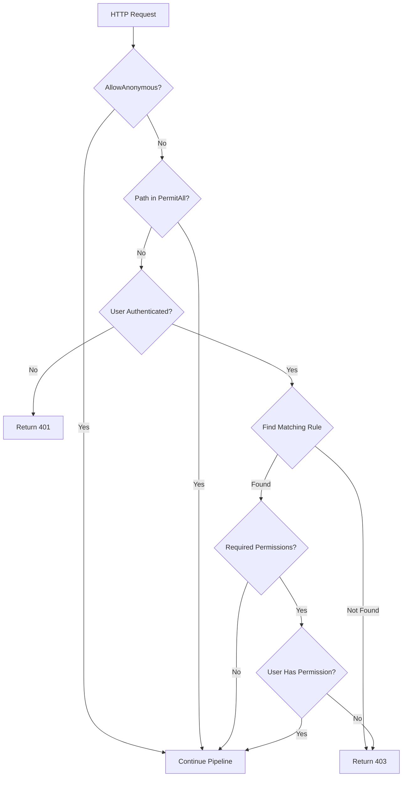

# ?? Permission Middleware

## Overview

**DynamicPermissionMiddleware** intercepts HTTP requests và validates permissions based on rules t? configuration.

---

## How It Works



---

## Middleware Flow

### 1. Check [AllowAnonymous]

```csharp
var endpoint = context.GetEndpoint();
if (endpoint?.Metadata?.GetMetadata<AllowAnonymousAttribute>() != null)
{
    // Skip permission check
    await _next(context);
    return;
}
```

### 2. Check PermitAll

```csharp
var path = context.Request.Path.Value;
var permitAll = await _provider.GetPermitAllAsync();

if (permitAll.Any(p => string.Equals(p, path, StringComparison.OrdinalIgnoreCase)))
{
    await _next(context);
    return;
}
```

### 3. Check Authentication

```csharp
if (!context.User.Identity?.IsAuthenticated ?? false)
{
    await WriteError(context, 401, CoreErrorCodes.SYSTEM_AUTHORIZATION);
 return;
}
```

### 4. Find Matching Rule

```csharp
var rules = await _provider.GetRulesAsync();
var method = context.Request.Method.ToUpperInvariant();

var rule = rules.FirstOrDefault(r => 
    r.HttpMethod == method && 
    r.PathRegex.IsMatch(path));

if (rule == null)
{
    await WriteError(context, 403, CoreErrorCodes.FORBIDDEN);
    return;
}
```

### 5. Validate Permissions

```csharp
var userId = context.User.FindFirst(ClaimTypes.NameIdentifier)?.Value;
var userPermissions = await _userPermissionService.GetPermissionsAsync(userId);

var hasPermission = rule.RequiredPermissions.Count == 0 || 
     rule.RequiredPermissions.Any(rp => userPermissions.Contains(rp));

if (!hasPermission)
{
    await WriteError(context, 403, CoreErrorCodes.FORBIDDEN);
  return;
}
```

---

## Registration

```csharp
// Program.cs
using BaseNetCore.Core.src.Main.Security.Permission;

var builder = WebApplication.CreateBuilder(args);

// 1. Register provider
builder.Services.AddSingleton<IDynamicPermissionProvider, DefaultDynamicPermissionProvider>();

// 2. Register user permission service
builder.Services.AddScoped<IUserPermissionService, UserPermissionService>();

var app = builder.Build();

// 3. Add middleware (AFTER UseRouting, UseAuthentication, UseAuthorization)
app.UseRouting();
app.UseAuthentication();
app.UseAuthorization();

app.UseMiddleware<DynamicPermissionMiddleware>();

app.MapControllers();
app.Run();
```

---

## Error Responses

### 401 Unauthorized

```json
{
  "guid": "abc-123",
  "code": "SYS008",
  "message": "Không có quy?n truy c?p d? li?u.",
  "path": "/api/products",
  "method": "POST",
  "timestamp": "2025-01-28T10:00:00Z"
}
```

### 403 Forbidden

```json
{
  "guid": "abc-123",
  "code": "SYS003",
  "message": "Không có quy?n truy c?p d? li?u.",
  "path": "/api/products",
  "method": "POST",
  "timestamp": "2025-01-28T10:00:00Z"
}
```

---

## Custom Middleware

```csharp
public class CustomPermissionMiddleware
{
    private readonly RequestDelegate _next;
    private readonly ILogger<CustomPermissionMiddleware> _logger;

    public CustomPermissionMiddleware(RequestDelegate next, ILogger<CustomPermissionMiddleware> logger)
    {
        _next = next;
 _logger = logger;
    }

    public async Task InvokeAsync(HttpContext context)
    {
   var path = context.Request.Path;
        var method = context.Request.Method;
        var userId = context.User.FindFirst(ClaimTypes.NameIdentifier)?.Value;

        _logger.LogInformation("Permission check: {Method} {Path} by User {UserId}", 
            method, path, userId);

        // Custom logic...

  await _next(context);
    }
}
```

---

## Bypass Middleware

### Option 1: [AllowAnonymous]

```csharp
[HttpGet("public")]
[AllowAnonymous]
public IActionResult PublicEndpoint()
{
    // Middleware skipped
}
```

### Option 2: PermitAll Configuration

```json
{
  "DynamicPermissions": {
    "PermitAll": [
      "/api/health",
      "/api/public/*"
    ]
  }
}
```

---

## Performance Considerations

### Caching Rules

```csharp
public class CachedPermissionProvider : IDynamicPermissionProvider
{
    private readonly IMemoryCache _cache;
    private readonly IDynamicPermissionProvider _inner;

    public async Task<IReadOnlyList<DynamicPermissionRule>> GetRulesAsync()
    {
  const string cacheKey = "permission:rules";
      
   if (_cache.TryGetValue(cacheKey, out IReadOnlyList<DynamicPermissionRule> cached))
   return cached;

  var rules = await _inner.GetRulesAsync();
   _cache.Set(cacheKey, rules, TimeSpan.FromMinutes(10));
        
        return rules;
    }
}
```

### Caching User Permissions

```csharp
public class CachedUserPermissionService : IUserPermissionService
{
    private readonly IMemoryCache _cache;
    private readonly IUserPermissionService _inner;

    public async Task<IReadOnlyList<string>> GetPermissionsAsync(string userId)
    {
   var cacheKey = $"user:permissions:{userId}";
     
  if (_cache.TryGetValue(cacheKey, out IReadOnlyList<string> cached))
       return cached;

 var permissions = await _inner.GetPermissionsAsync(userId);
        _cache.Set(cacheKey, permissions, TimeSpan.FromMinutes(5));
        
     return permissions;
    }
}
```

---

**[? Back to Documentation](../README.md)**
