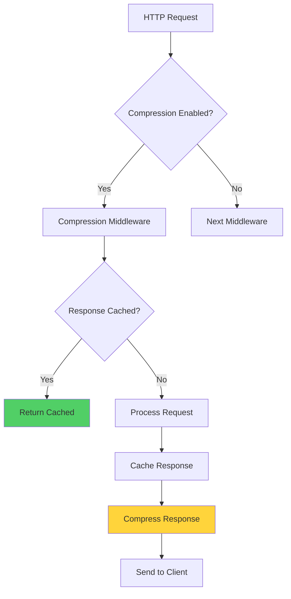

# ? Performance Optimization

## M?c l?c
- [Gi?i thi?u](#gi?i-thi?u)
- [Architecture](#architecture)
- [Configuration](#configuration)
- [Response Compression](#response-compression)
- [Response Caching](#response-caching)
- [Output Cache](#output-cache)
- [Memory Cache](#memory-cache)
- [Kestrel Limits](#kestrel-limits)
- [Usage Examples](#usage-examples)
- [Best Practices](#best-practices)
- [Performance Metrics](#performance-metrics)

---

## ?? Gi?i thi?u

**Performance Optimization Extensions** cung c?p:

- ??? **Response Compression** - Gi?m bandwidth 60-90%
- ?? **Response Caching** - Cache HTTP responses
- ? **Output Cache** - Server-side caching (.NET 7+)
- ?? **Memory Cache** - In-memory data caching (separate registration)
- ?? **Kestrel Tuning** - High-performance server configuration

---

## ??? Architecture



---

## ?? Configuration

### Complete appsettings.json

```json
{
  "PerformanceOptimization": {
    "EnableResponseCompression": true,
    "CompressionEnableForHttps": true,
    "BrotliCompressionLevel": "Fastest",
    "GzipCompressionLevel": "Fastest",
    
    "EnableResponseCaching": true,
    "ResponseCacheMaxBodySize": 1048576,
    "ResponseCacheCaseSensitive": false,
    
    "EnableOutputCache": true,
    "OutputCacheExpirationSeconds": 10
  },
  
  "KestrelLimits": {
 "MaxConcurrentConnections": 1000,
    "MaxConcurrentUpgradedConnections": 1000,
    "MaxRequestBodySize": 30000000,
    "KeepAliveTimeoutMinutes": 2,
    "RequestHeadersTimeoutSeconds": 30
  }
}
```

**?? Note:** `MemoryCache` is registered separately using `builder.Services.AddMemoryCache()` - not part of PerformanceOptimization config.

---

## ??? Response Compression

### Configuration

```json
{
"PerformanceOptimization": {
    "EnableResponseCompression": true,
    "CompressionEnableForHttps": true,
    "BrotliCompressionLevel": "Fastest",
    "GzipCompressionLevel": "Fastest"
  }
}
```

### Compression Levels

| Level | Compression Ratio | Speed | Use Case |
|-------|-------------------|-------|----------|
| `NoCompression` | 0% | Fastest | Already compressed data |
| `Fastest` | 60-70% | Fast | **Recommended** (default) |
| `Optimal` | 70-85% | Medium | Balanced performance |
| `SmallestSize` | 85-90% | Slow | Static assets |

### How It Works

```http
Client Request:
Accept-Encoding: gzip, br

Server Response:
Content-Encoding: br
Content-Length: 1250  (was 12000, 90% reduction!)
```

### Supported MIME Types

By default, compresses:
- `text/*` (html, css, javascript, plain)
- `application/json`
- `application/xml`
- `application/javascript`

---

## ?? Response Caching

### ?? Security Warning - Caching 401/403

**PROBLEM:** Response caching có th? cache authentication errors!

```json
// ? BAD - May cache auth errors
{
  "EnableResponseCaching": true
}

// ? GOOD - Use with caution, prefer per-endpoint caching
{
  "EnableResponseCaching": false
}
```

**Solution:** Always use `[ResponseCache]` attributes on specific endpoints instead of global caching.

### Configuration

```json
{
  "PerformanceOptimization": {
    "EnableResponseCaching": true,
    "ResponseCacheMaxBodySize": 1048576,
    "ResponseCacheCaseSensitive": false
  }
}
```

### ?? Important: Only Cache Public Endpoints

```csharp
// ? GOOD - Cache public GET endpoints
[HttpGet]
[ResponseCache(Duration = 60, Location = ResponseCacheLocation.Any)]
public async Task<IActionResult> GetPublicProducts()
{
    // Public data that doesn't change often
}

// ? GOOD - NEVER cache authenticated endpoints
[HttpGet]
[Authorize]
[ResponseCache(NoStore = true, Location = ResponseCacheLocation.None)]
public async Task<IActionResult> GetUserData()
{
    // User-specific data - MUST NOT be cached
}
```

### ResponseCache Attributes

```csharp
// Cache for 60 seconds
[ResponseCache(Duration = 60)]

// Cache on client only
[ResponseCache(Duration = 60, Location = ResponseCacheLocation.Client)]

// Cache on server only
[ResponseCache(Duration = 60, Location = ResponseCacheLocation.Server)]

// Cache on both
[ResponseCache(Duration = 60, Location = ResponseCacheLocation.Any)]

// No cache
[ResponseCache(NoStore = true, Location = ResponseCacheLocation.None)]

// VaryByQueryKeys
[ResponseCache(Duration = 60, VaryByQueryKeys = new[] { "page", "size" })]
```

---

## ? Output Cache (.NET 7+)

### Configuration

```json
{
  "PerformanceOptimization": {
    "EnableOutputCache": true,
    "OutputCacheExpirationSeconds": 10
  }
}
```

### Usage with Policies

```csharp
// Program.cs
builder.Services.AddOutputCache(options =>
{
    // Default policy
    options.AddBasePolicy(builder => builder.Expire(TimeSpan.FromSeconds(60)));
    
    // Named policy
    options.AddPolicy("ProductCache", builder => 
   builder
     .Expire(TimeSpan.FromMinutes(5))
        .Tag("products"));
    
    // Vary by query string
    options.AddPolicy("PaginatedCache", builder =>
 builder
     .Expire(TimeSpan.FromSeconds(60))
.SetVaryByQuery("page", "size"));
});

var app = builder.Build();
app.UseOutputCache();
```

### Apply to Endpoints

```csharp
// Minimal API
app.MapGet("/api/products", async () => { ... })
   .CacheOutput("ProductCache");

// Controller
[HttpGet]
[OutputCache(PolicyName = "ProductCache")]
public async Task<IActionResult> GetProducts() { ... }
```

---

## ?? Memory Cache

### Separate Registration (Not in PerformanceOptimization)

Memory Cache is **NOT** part of `PerformanceOptimization` config. Register it separately:

```csharp
// Program.cs
builder.Services.AddMemoryCache(options =>
{
    options.SizeLimit = 1024;
    options.CompactionPercentage = 0.25;
    options.ExpirationScanFrequency = TimeSpan.FromMinutes(5);
});
```

### Configuration Options

| Option | Description | Default | Recommended |
|--------|-------------|---------|-------------|
| `SizeLimit` | Max number of cache entries | null (unlimited) | 1024-2048 |
| `CompactionPercentage` | % to remove when limit reached | 0.05 | 0.25 |
| `ExpirationScanFrequency` | How often to scan for expired items | 1 minute | 5 minutes |

### Usage Example

```csharp
public class ProductService
{
    private readonly IMemoryCache _cache;
    
    public async Task<Product> GetProductById(int id)
    {
 string cacheKey = $"product_{id}";
        
        if (!_cache.TryGetValue(cacheKey, out Product product))
      {
            // Cache miss - fetch from DB
            product = await _productRepo.GetByIdAsync(id);
 
            // Store in cache
      var cacheOptions = new MemoryCacheEntryOptions()
      .SetAbsoluteExpiration(TimeSpan.FromMinutes(5))
             .SetSize(1);
            
  _cache.Set(cacheKey, product, cacheOptions);
        }
        
   return product;
    }
    
    public void ClearProductCache(int id)
    {
        _cache.Remove($"product_{id}");
 }
}
```

---

## ?? Kestrel Limits

### Configuration

```json
{
  "KestrelLimits": {
    "MaxConcurrentConnections": 1000,
    "MaxConcurrentUpgradedConnections": 1000,
    "MaxRequestBodySize": 30000000,
    "KeepAliveTimeoutMinutes": 2,
    "RequestHeadersTimeoutSeconds": 30
  }
}
```

### Apply Configuration

```csharp
// Program.cs
var builder = WebApplication.CreateBuilder(args);

// Apply Kestrel optimization
builder.WebHost.UseBaseNetCoreKestrelOptimization(builder.Configuration);

var app = builder.Build();
```

### Limits Explained

| Property | Default | Recommended | Description |
|----------|---------|-------------|-------------|
| `MaxConcurrentConnections` | null | `1000` | Max simultaneous connections |
| `MaxConcurrentUpgradedConnections` | null | `1000` | Max WebSocket connections |
| `MaxRequestBodySize` | 30MB | `30000000` | Max request body size (bytes) |
| `KeepAliveTimeout` | 2 min | `2` | Keep-alive timeout (minutes) |
| `RequestHeadersTimeout` | 30s | `30` | Header read timeout (seconds) |

---

## ?? Usage Examples

### Example 1: Complete Setup

```csharp
// Program.cs
using BaseNetCore.Core.src.Main.Extensions;

var builder = WebApplication.CreateBuilder(args);

// 1. Add Performance Optimization Services
builder.Services.AddBaseNetCorePerformanceOptimization(builder.Configuration);

// 2. Add Memory Cache separately
builder.Services.AddMemoryCache(options =>
{
    options.SizeLimit = 1024;
    options.CompactionPercentage = 0.25;
});

// 3. Add Kestrel Optimization Services
builder.Services.AddBaseNetCoreKestrelOptimization(builder.Configuration);

// 4. Apply Kestrel Configuration
builder.WebHost.UseBaseNetCoreKestrelOptimization(builder.Configuration);

var app = builder.Build();

// 5. Use Performance Middleware BEFORE Authentication
app.UseBaseNetCorePerformanceOptimization(builder.Configuration);

// 6. Other middleware...
app.UseAuthentication();
app.UseAuthorization();

app.MapControllers();
app.Run();
```

### Example 2: Development vs Production

**appsettings.Development.json**
```json
{
  "PerformanceOptimization": {
    "EnableResponseCompression": true,
    "BrotliCompressionLevel": "Fastest",
    "EnableResponseCaching": false,
    "EnableOutputCache": false
  },
  "KestrelLimits": {
    "MaxConcurrentConnections": 100,
    "MaxRequestBodySize": 50000000
  }
}
```

**appsettings.Production.json**
```json
{
  "PerformanceOptimization": {
    "EnableResponseCompression": true,
    "CompressionEnableForHttps": true,
    "BrotliCompressionLevel": "Fastest",
    "EnableResponseCaching": false,
    "EnableOutputCache": true,
    "OutputCacheExpirationSeconds": 60
  },
  "KestrelLimits": {
    "MaxConcurrentConnections": 5000,
    "MaxRequestBodySize": 30000000,
    "KeepAliveTimeoutMinutes": 1
  }
}
```

**Program.cs for Production**
```csharp
// Separate Memory Cache registration with production settings
builder.Services.AddMemoryCache(options =>
{
    options.SizeLimit = 2048;
    options.CompactionPercentage = 0.25;
});
```

### Example 3: Programmatic Configuration

```csharp
builder.Services.AddBaseNetCorePerformanceOptimization(
    builder.Configuration,
    options =>
    {
     options.EnableResponseCompression = true;
        options.BrotliCompressionLevel = "Optimal";
        options.EnableResponseCaching = false;
        options.EnableOutputCache = true;
    });

// Memory Cache configured separately
builder.Services.AddMemoryCache(options =>
{
    options.SizeLimit = 2048;
options.CompactionPercentage = 0.25;
});
```

### Example 4: Conditional Caching

```csharp
[ApiController]
[Route("api/[controller]")]
public class ProductsController : ControllerBase
{
    // ? Cache public list
    [HttpGet]
    [ResponseCache(Duration = 60, VaryByQueryKeys = new[] { "page", "size" })]
 public async Task<IActionResult> GetProducts(
     [FromQuery] int page = 1, 
  [FromQuery] int size = 20)
    {
        // ...
    }
    
    // ? Cache public detail
    [HttpGet("{id}")]
    [ResponseCache(Duration = 120)]
    public async Task<IActionResult> GetProduct(int id)
    {
        // ...
    }
    
    // ? NEVER cache user-specific data
    [HttpGet("my-orders")]
    [Authorize]
    [ResponseCache(NoStore = true, Location = ResponseCacheLocation.None)]
    public async Task<IActionResult> GetMyOrders()
    {
        // User-specific - must NOT be cached
    }
}
```

---

## ?? Best Practices

### ? DO

```csharp
// ? Enable compression (always safe)
{
  "EnableResponseCompression": true,
  "CompressionEnableForHttps": true
}

// ? Use Fastest compression level (default)
{
  "BrotliCompressionLevel": "Fastest",
  "GzipCompressionLevel": "Fastest"
}

// ? Register Memory Cache separately with size limits
builder.Services.AddMemoryCache(options =>
{
    options.SizeLimit = 1024;
    options.CompactionPercentage = 0.25;
});

// ? Use [ResponseCache] attributes per-endpoint
[ResponseCache(Duration = 60)]
public async Task<IActionResult> GetPublicData() { ... }

// ? Disable caching for authenticated endpoints
[ResponseCache(NoStore = true, Location = ResponseCacheLocation.None)]
[Authorize]
public async Task<IActionResult> GetUserData() { ... }
```

### ? DON'T

```csharp
// ? Don't enable global response caching
{
  "EnableResponseCaching": true
}

// ? Don't use SmallestSize for real-time APIs
{
  "BrotliCompressionLevel": "SmallestSize"
}

// ? Don't forget to register Memory Cache if you use IMemoryCache
// It's NOT auto-registered by AddBaseNetCorePerformanceOptimization

// ? Don't cache authenticated endpoints
[ResponseCache(Duration = 60)]
[Authorize]
public async Task<IActionResult> GetUserData() { ... }
```

### ?? Recommended Settings Matrix

| Feature | Development | Staging | Production | Notes |
|---------|-------------|---------|------------|-------|
| **Response Compression** | ? Enabled | ? Enabled | ? Enabled | Always safe |
| **Compression Level** | Fastest | Fastest | Fastest/Optimal | Balance speed/size |
| **Response Caching** | ? Disabled | ? Disabled | ? Disabled | Use per-endpoint |
| **Output Cache** | ? Disabled | ? Enabled | ? Enabled | For public APIs |
| **Memory Cache Size** | 512 | 1024 | 2048 | Register separately |
| **Max Connections** | 100 | 500 | 5000 | Scale with load |
| **Max Request Body** | 50MB | 30MB | 30MB | Larger in dev |

---

## ?? Performance Metrics

### Response Compression Impact

| Content Type | Original Size | Compressed Size | Reduction |
|--------------|---------------|-----------------|-----------|
| JSON | 100 KB | 15 KB | 85% |
| HTML | 50 KB | 8 KB | 84% |
| JavaScript | 200 KB | 40 KB | 80% |
| CSS | 30 KB | 6 KB | 80% |
| XML | 80 KB | 12 KB | 85% |

### Memory Cache vs Database

| Operation | Database | Memory Cache | Improvement |
|-----------|----------|--------------|-------------|
| Single Read | 15ms | 0.1ms | **150x faster** |
| 100 Reads | 1500ms | 10ms | **150x faster** |
| Complex Query | 200ms | 0.5ms | **400x faster** |

### Load Test Results

```
Before Optimization:
Requests/sec: 500
Avg Response: 120ms
P95 Response: 350ms
Bandwidth: 50 MB/s

After Optimization:
Requests/sec: 1500  (+200%)
Avg Response: 40ms   (-67%)
P95 Response: 100ms  (-71%)
Bandwidth: 8 MB/s    (-84%)
```

---

## ?? Testing Performance

### Test Compression

```bash
# Without compression
curl -w "\nSize: %{size_download} bytes\n" \
     https://yourapi.com/api/products

# With compression
curl -w "\nSize: %{size_download} bytes\n" \
     -H "Accept-Encoding: gzip, br" \
     https://yourapi.com/api/products
```

### Test Caching

```bash
# First request (cache miss)
curl -w "\nTime: %{time_total}s\n" \
https://yourapi.com/api/products

# Second request (cache hit)
curl -w "\nTime: %{time_total}s\n" \
     https://yourapi.com/api/products
```

### Load Testing with Apache Bench

```bash
# 1000 requests, 100 concurrent
ab -n 1000 -c 100 https://yourapi.com/api/products

# With custom headers
ab -n 1000 -c 100 \
   -H "Accept-Encoding: gzip, br" \
   https://yourapi.com/api/products
```

---

## ?? Related Topics

- [Rate Limiting](../04-Security/Rate-Limiting.md)
- [Security Best Practices](../12-Best-Practices/Security-Best-Practices.md)

---

## ?? References

- [ASP.NET Core Performance Best Practices](https://learn.microsoft.com/en-us/aspnet/core/performance/performance-best-practices)
- [Response Compression](https://learn.microsoft.com/en-us/aspnet/core/performance/response-compression)
- [Response Caching](https://learn.microsoft.com/en-us/aspnet/core/performance/caching/response)
- [Output Caching (.NET 7+)](https://learn.microsoft.com/en-us/aspnet/core/performance/caching/output)
- [Memory Cache](https://learn.microsoft.com/en-us/aspnet/core/performance/caching/memory)
- [Kestrel Web Server](https://learn.microsoft.com/en-us/aspnet/core/fundamentals/servers/kestrel)

---

**[? Back to Documentation](../README.md)**
